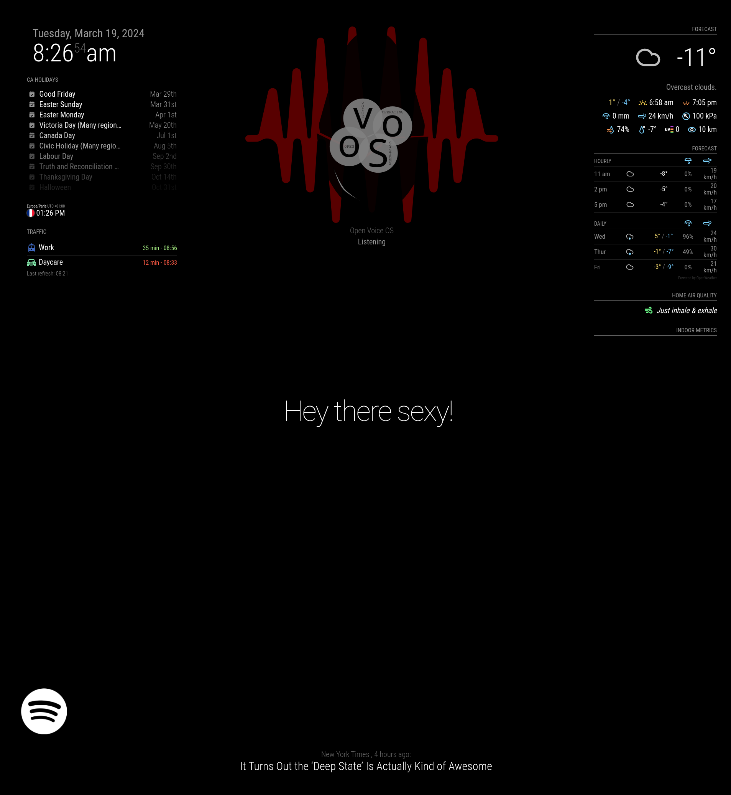

[](https://opensource.org/licenses/MIT) [](https://github.com/smartgic/MMM-ovos-wakeword/pulls) [](https://magicmirror.builders/) [](https://discord.com/invite/sHM3Duz5d3)

# MMM-ovos-wakeword

This module interacts with the [MagicMirror](https://magicmirror.builders/) to let you know if [Open Voice OS](https://openvoiceos.org/) is listening. When a wake word is detected, an image is displayed and when the recording is done the image disappears.



The [Open Voice OS MagicMirror² wake word skill](https://github.com/smartgic/ovos-magicmirror-wakeword-skill) interacts with this MagicMirror² module which is why this skill is required on the Open Voice OS device.

## Installation

Clone this repository into `~/MagicMirror/modules` _(replace with your path)_ directory.

```bash
cd ~/MagicMirror/modules
git clone https://github.com/smartgic/MMM-ovos-wakeword.git
```

Then update the MagicMirror configuration file `~/MagicMirror/config/config.js` _(replace with your path)_.

```js
{
    module: "MMM-ovos-wakeword",
    position: "lower_third",
    config: {
        title: "Open Voice OS",
        apiKey: "en323q9WBNMK3Q04WIPNEAsdfhesammhp44",
        maxMessages: 1,
        opacity: 0.5
    }
}
```

## Configuration

In order to reach the `/ovos` route on your MagicMirror, you need to allow the remote connection for a specific IP address or for a network range in your MagicMirror by changing the `~/MagicMirror/config/config.js` _(replace with your path)_.

```js
ipWhitelist: ['127.0.0.1', '::ffff:127.0.0.1', '::1', '::ffff:192.168.1.1/24'];
```

The example above will allows all the connection from `192.168.1.0/24` network to perform remote connections.

| Option        | Default         | Description                                                              |
| ------------- | --------------- | ------------------------------------------------------------------------ |
| `maxMessages` | `5`             | How many messages should be displayed on the screen.                     |
| `image`       | `wakeword.png`  | Image file to use _(the image should be within the `images` directory)_. |
| `width`       | `100%`          | Image max width size.                                                    |
| `height`      | `100%`          | Image max height size.                                                   |
| `opacity`     | `1.0`           | Image opacity.                                                           |
| `title`       | `Open Voice OS` | The name placed above the received messages.                             |
| `apiKey`      | `None`          | API key required to `POST` a notification.                               |

## API

This module expose an extra route, `/ovos` which only supports `POST` method.

| Header    | Description                                                                          |
| --------- | ------------------------------------------------------------------------------------ |
| X-Api-Key | This should match the `apiKey` value registered into MagicMirror configuration file. |

| Parameter    | Description                                                                                        |
| ------------ | -------------------------------------------------------------------------------------------------- |
| notification | Notification identifier, if set to `OVOS_SEND_MESSAGE`, the payload will be printed by the module. |
| payload      | JSON payload to pass to the notification.                                                          |

Only two notifications are supported:

- `OVOS_SEND_MESSAGE`
- `OVOS_DELETE_MESSAGE`

## `curl` examples

This command displays an image on the mirror with the `Listening` message.

```bash
$ curl -H "Content-Type: application/json" \
    -H "X-Api-Key: en323q9WBNMK3Q04WIPNEAsdfhesammhp44" \
    -X POST \
    -d '{"notification":"OVOS_SEND_MESSAGE", "payload": "Listening"}' \
    http://192.168.1.97:8080/ovos
```

This command deletes the image on the mirror.

```bash
$ curl -H "Content-Type: application/json" \
    -H "X-Api-Key: en323q9WBNMK3Q04WIPNEAsdfhesammhp44" \
    -X POST \
    -d '{"notification":"OVOS_DELETE_MESSAGE", "payload": "null"}' \
    http://192.168.1.97:8080/ovos
```

## Credits

This module has been forked from [MMM-kalliope](https://github.com/kalliope-project/MMM-kalliope) and refactored by [Smart'Gic](https://smartgic.io).
